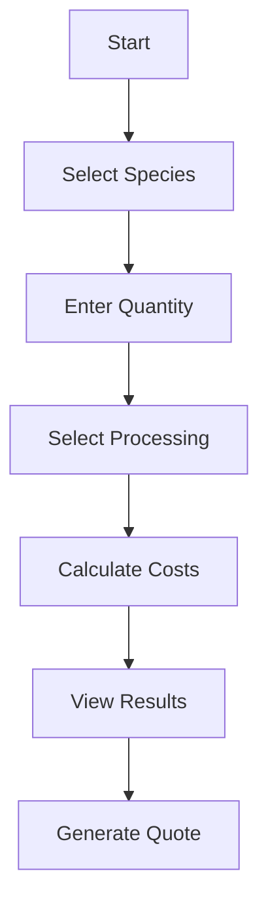
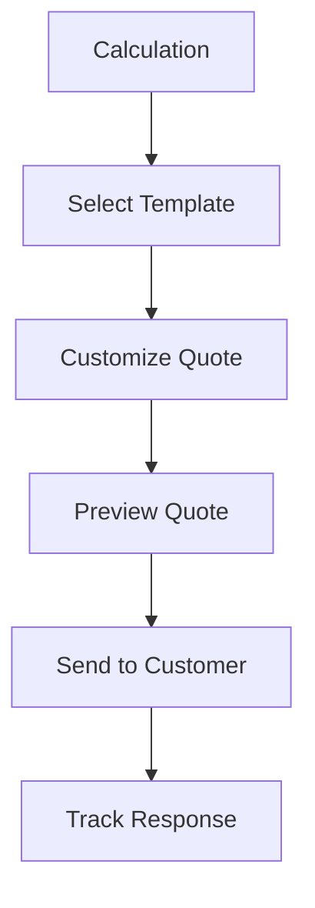

# Product Context

## Purpose and Problem Space
The Seafood Calculator is a comprehensive cross-platform solution for the seafood industry, providing accurate cost calculations, yield tracking, and quote generation. Available on web, iOS, and Android, it serves as a central tool for seafood business operations.

## Core Problems Solved

1. Calculation Complexity
   - Species-specific yield calculations
   - Multi-step processing costs
   - Variable market pricing
   - Transportation cost optimization

2. Business Operations
   - Professional quote generation
   - Customer relationship management
   - Pricing strategy support
   - Margin analysis

3. Market Intelligence
   - Historical price tracking
   - Yield performance analysis
   - Market trend visualization
   - Competitive pricing insight

## User Experience Goals

1. Cross-Platform Accessibility
   - Seamless web experience
   - Native mobile apps
   - Offline capability
   - Data synchronization

2. Professional Interface
   - Clean, modern design
   - Intuitive navigation
   - Quick data entry
   - Clear results presentation

3. Business Integration
   - Export to common formats
   - CRM integration
   - Email quote generation
   - Team collaboration

## Target Users

### Primary Users
- Seafood processors
- Business managers
- Sales representatives
- Cost analysts

### Secondary Users
- Quality control staff
- Logistics coordinators
- Financial planners
- Market analysts

## Key Features

### Phase 1: MVP
1. Basic Calculator
   - Species selection
   - Yield calculation
   - Cost computation
   - Basic reporting

2. Web Platform
   - Responsive design
   - Core calculations
   - Data persistence
   - User accounts

### Phase 2: Mobile
1. Native Apps
   - iOS application
   - Android application
   - Offline mode
   - Push notifications

2. Enhanced Features
   - Quote generation
   - PDF export
   - Share functionality
   - Team access

### Phase 3: Premium
1. Advanced Features
   - Bulk calculations
   - Custom templates
   - Advanced analytics
   - API access

2. Business Tools
   - CRM integration
   - Email marketing
   - Team management
   - Custom branding

### Phase 4: Enterprise
1. Scaling Features
   - Multi-region support
   - Advanced security
   - Custom integration
   - Dedicated support

## User Flows

### Calculator Flow

### Quote Generation

## Success Metrics
1. User Adoption
   - Active users
   - Usage frequency
   - Feature utilization
   - Platform distribution

2. Business Impact
   - Calculation accuracy
   - Time savings
   - Quote conversion
   - Revenue generation

3. Technical Performance
   - System uptime
   - Calculation speed
   - Data accuracy
   - Sync reliability

## Monetization Strategy
1. Freemium Model
   - Basic calculations free
   - Premium features subscription
   - Enterprise custom pricing
   - Add-on services

2. Premium Features
   - Advanced analytics
   - Bulk operations
   - Custom branding
   - Priority support

## Future Considerations
1. Market Expansion
   - Additional species
   - Regional customization
   - Language support
   - Industry partnerships

2. Feature Evolution
   - Machine learning
   - Market predictions
   - Blockchain integration
   - IoT device support