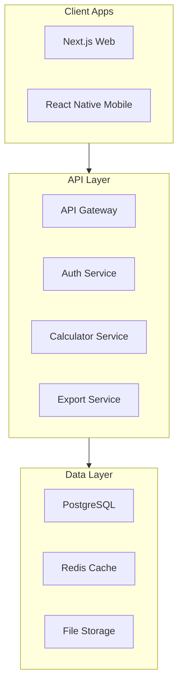
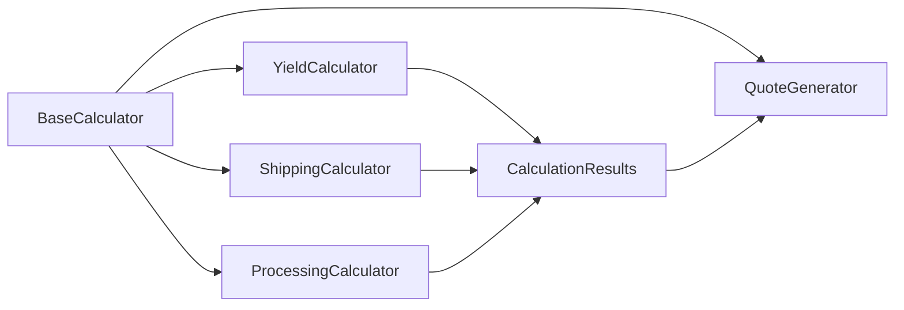
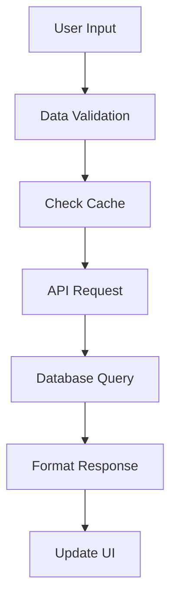

# System Patterns

## Architecture Overview

## Design Patterns

### Monorepo Patterns
1. Workspace Organization
   - Apps for platform-specific code
   - Packages for shared code
   - Clear dependency management
   - Cross-platform type safety

2. Code Sharing
   - UI components in ui package
   - Business logic in calculator package
   - Database access in database package
   - Types in types package

3. Build Process
   - Turborepo pipeline configuration
   - Cached builds for speed
   - Platform-specific outputs
   - Development mode handling

### Frontend Patterns
1. Component Architecture
   - React Native components for cross-platform
   - Platform-specific views when needed
   - Shared styling system
   - Reusable calculator modules

2. State Management
   - React Query for server state
   - Form state with controlled components
   - Shared state in calculator package
   - Cache management strategy

3. Data Flow
   - Type-safe API integration
   - Real-time calculation updates
   - Offline capability
   - Cross-platform data sync

### Backend Patterns
1. API Design
   - RESTful endpoints
   - GraphQL consideration for future
   - Controller-Service pattern
   - Middleware chain

2. Database Access
   - Prisma client in database package
   - Connection pooling
   - Cache strategy
   - Migration management

3. Error Handling
   - Standardized error responses
   - Cross-platform error display
   - Logging strategy
   - Monitoring setup

## Component Relationships

### Calculator Components

### Data Flow Pattern

## Implementation Guidelines

### Development Flow
1. Feature Planning
   - Cross-platform consideration
   - Package organization
   - Dependency management
   - Type definition

2. Implementation
   - Shared code first
   - Platform-specific adaptations
   - Test coverage
   - Documentation

3. Review Process
   - Type checking
   - Performance testing
   - Cross-platform testing
   - Code review

### Deployment Strategy
1. Build Process
   - Turborepo pipeline
   - Platform artifacts
   - Environment configuration
   - Version management

2. Release Flow
   - Web deployment
   - Mobile app submission
   - Database migrations
   - Cache warming

## Technical Decisions
1. Turborepo for monorepo management
2. React Native Web for cross-platform UI
3. Prisma for database access
4. Redis for caching
5. TypeScript for type safety
6. Docker for development
7. shadcn/ui for components
8. Expo for mobile